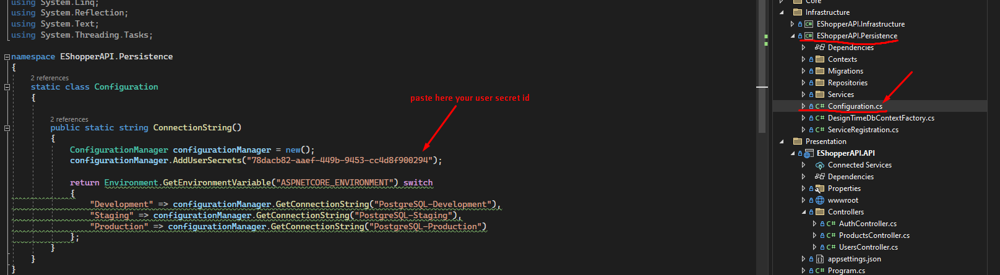

## About The Project
This is the API component of an e-commerce application project. It is a REST API built using the onion architecture. It adheres to the clean code principles. Its purpose is to resolve the data dependency problem in n-tier structures through the utilization of onion architecture.

### Built with
 [![c#][c#.com]][c#-url] 

 [![.net][.net.com]][.net-url] 

 [![.docker][docker.com]][docker-url]

 [![postgre][postgre.com]][postgre-url]
## Getting Started
To set up a local copy and get it running, follow these simple steps as examples.

### Prerequisites
* install dotnet
    ```sh
    winget install Microsoft.DotNet.SDK.6
    ```

* install entity framework
  ```sh
  dotnet tool install --global dotnet-ef
  ```
  
* install docker - https://www.docker.com
* build postgresql container
    ```sh
    docker run --name PostgreSQL -p 5432:5432 -e POSTGRES_PASSWORD=123456 -d postgres
    ```

### Installation
   ```sh
    git clone https://github.com/EgemenTosyali/EShopperAPI.git
   ```

### Configurations
* You need to add a user secret to the EShopperAPI.API project.

 


* The user secrets file can be found at this path: "%APPDATA%\Microsoft\UserSecrets".


* Ensure that you locate the correct user secret.


* Copy the filename in which the user secret is stored.


* Paste the user secret into the file "Configuration.cs" located in the "EShopperAPI.Persistence" directory.



* Choose a storage system. If you don't have Google Storage or Azure, you can opt for local storage.


* To perform the initial database migration, navigate to the "EShopperAPI.Persistence" directory in the Package Manager Console. Make sure you are executing the command in the "Infrastructure" folder within "EShopperAPI.Persistence".


## Contributing
If you have any suggestions to improve this, feel free to fork the repository and submit a pull request. Alternatively, you can create an issue with the "enhancement" tag. Don't forget to show your support by starring the project! Thank you once again!

1. Fork the Project
2. Create your Feature Branch (`git checkout -b feature/AmazingFeature`)
3. Commit your Changes (`git commit -m 'Add some AmazingFeature'`)
4. Push to the Branch (`git push origin feature/AmazingFeature`)
5. Open a Pull Request

## Contact

Egemen Tosyali - egementosyalitr@gmail.com

Project Link: [https://github.com/egementosyali/eshopperapi](https://github.com/egementosyali/eshopperapi)


[c#.com]: https://img.shields.io/badge/c%23-%23239120.svg?style=for-the-badge&logo=c-sharp&logoColor=white
[c#-url]: https://www.w3schools.com/cs/

[.net.com]:https://img.shields.io/badge/.NET-5C2D91?style=for-the-badge&logo=.net&logoColor=white
[.net-url]:https://dotnet.microsoft.com/

[docker.com]: https://img.shields.io/badge/docker-%230db7ed.svg?style=for-the-badge&logo=docker&logoColor=white
[docker-url]: https://www.docker.com/

[postgre.com]: https://img.shields.io/badge/postgres-%23316192.svg?style=for-the-badge&logo=postgresql&logoColor=white
[postgre-url]: https://www.postgresql.org/

